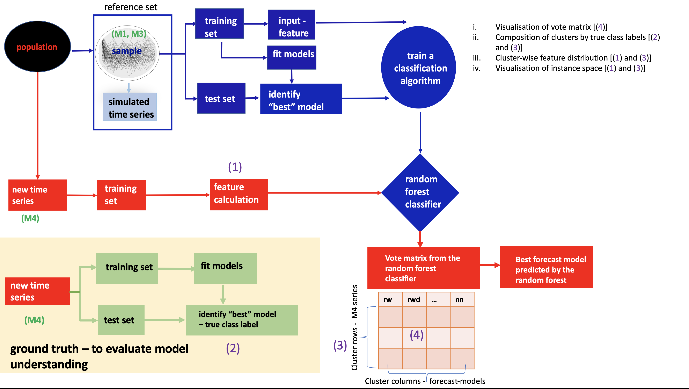

```{r setup, include=FALSE, message=FALSE, warning=FALSE}
library(flexdashboard)
library(here)
library(tidyverse)
library(plotly)
library(iheatmapr) # To plot vote matrix probabilities
```

```{r, comment=NA}
load(here("data", "quarterly", "quarterlym4_votes.rda"))
monthlym4_votes <-readRDS(here("data", "monthly", "monthlym4_votes.rds"))
load(here("data", "daily", "dailym4_votes.rda"))
load(here( "data", "hourly", "hourlym4_votes.rda"))
load(here("data", "weekly", "M4weekly_votes.rda"))
```


# Yearly 

Column {data-width=650}
-----------------------------------------------------------------------

#### Y1: Vote-matrix probabilities: yearly

```{r, fig.height=10, fig.width=8}
load(here( "data", "yearly", "yearlym4_votes.rda"))

set.seed(10011)# 1, 10011
yheatmap <- iheatmapr::main_heatmap(yearlym4_votes, name="Vote probability") %>%
  add_row_clustering(method="kmeans", k = 5) %>%
  add_col_clustering(method="kmeans", k=4) %>%
  add_col_labels(size=0.2, textangle = -90) %>%
  add_row_title("Time series (each row corresponds to a single time series)") %>%
  add_col_title("Class", side="top")  
yheatmap
```


Column {data-width=350}{.tabset .tabset-fade}
-----------------------------------------------------------------------

### Y2: Composition of clusters by true class labels

```{r, fig.height=8}
load(here("data", "yearly", "ym4_true_classlabels.rda"))

row_cluster_yearly <- yheatmap@plots@listData$`Row<br>Clusters`@data 
yearly_m4_clus <- data.frame(cluster=row_cluster_yearly)

yearly_m4_clus$trueLabel <- factor(ym4_true_classlabels,
                                      levels=c("nn", "rw", "theta", "ARMA/AR/MA","ETS-dampedtrend", "ETS-notrendnoseasonal",
                                        "wn", "rwd", "ARIMA", "ETS-trend"))

yearly_m4_clus$cluster <- factor(yearly_m4_clus$cluster,
                                   c(5, 4, 3, 2, 1))

py <- ggplot(yearly_m4_clus, 
       aes(trueLabel, fill=cluster)) + 
  geom_bar() + 
  facet_wrap(~cluster, ncol=1)+
 scale_fill_manual(values=rev(c("#1b9e77","#d95f02",
                       "#7570b3", "#e7298a", "#66a61e"))) + 
  theme(axis.text.x = element_text(angle = 90)) + xlab("True class label") + ylab("Count")+ 
  ggtitle("Composition of clusters by true class labels")

ggplotly(py)


```


### Y3: Cluster-wise feature distribution

```{r, fig.height=15}
features_M4Y <-
  readRDS(here( "data", "yearly", "features_M4Y.rds"))


fclusy <- data.frame(trend = features_M4Y$trend,
                     diff1y_acf1 = features_M4Y$diff1y_acf1,
                     diff2y_acf1 = features_M4Y$diff2y_acf1,
                     entropy = features_M4Y$entropy,
  cluster = yearly_m4_clus$cluster)
fclusy <- pivot_longer(fclusy, 1:4)

ggplot(fclusy, aes(x=cluster, y=value, fill=cluster)) + geom_boxplot() + facet_wrap(~name, ncol=1, scales = "free") + scale_fill_manual(values=rev(c("#1b9e77","#d95f02",
                       "#7570b3", "#e7298a", "#66a61e")))
```


### Y4: Visualisation of the instance space

```{r}
calculate_pca <- function(feature_dataset){
  pcaY_cal <- prcomp(feature_dataset, center = TRUE, scale = TRUE)
  PCAresults <- data.frame(PC1 = pcaY_cal$x[, 1], 
                           PC2 = pcaY_cal$x[, 2], 
                           PC3 = pcaY_cal$x[, 3])
  return(list(prcomp_out =pcaY_cal,pca_components = PCAresults))
}

pca_projection <- function(prcomp_out, data_to_project){
  
  PCA <- scale(data_to_project, prcomp_out$center, prcomp_out$scale) %*% prcomp_out$rotation
  pca_projected <- data.frame(PC1=PCA[,1], PC2=PCA[,2], PC3=PCA[,3]) 
  return(pca_projected)
  
}

pca_ref_calc <- calculate_pca(features_M4Y)
df <- pca_ref_calc$pca_components
df$class <- yearly_m4_clus$cluster 

#pca_df <- data.frame(pc_x = c(df$PC1, df$PC1, df$PC2),
#                     pc_y = c(df$PC2, df$PC3, df$PC3),
 #                    frame=factor(rep(1:3, each=2300)), #col=rep(yearly_m4_clus$cluster, 3))

#pcy <- ggplot(pca_df, aes(x=pc_x, y=pc_y, frame=frame)) +
#  geom_point(aes(colour=col))
#ggplotly(pcy)

plot_ly(df, x=~PC1, y=~PC2, z=~PC3, type="scatter3d", 
        mode="markers", color=df$class, opacity=0.7, size=18,
        colors    = ~c("#1b9e77","#d95f02",
                       "#7570b3", "#e7298a", "#66a61e"))
```


# Quarterly

Column {data-width=650}
-----------------------------------------------------------------------

#### Q1: Vote-matrix probabilities: quarterly

```{r quarterlyvote, fig.height=10, fig.width=8}
set.seed(1)# 1, 10011
qheatmap <- iheatmapr::main_heatmap(quarterlym4_votes, name="Vote probability") %>%
  add_row_clustering(method="kmeans", k = 5) %>%
  add_col_clustering(method="kmeans", k=4) %>%
  add_col_labels(size=0.2, textangle = -90) %>%
  add_row_title("Time series (each row corresponds to a single time series)") %>%
  add_col_title("Class", side="top")  
qheatmap
```

Column {data-width=300}{.tabset .tabset-fade}
-----------------------------------------------------------------------

### Q2: Composition of clusters by true class labels


```{r}
load(here( "data", "quarterly", "qm4_true_classlabels.rda"))

row_cluster_quarterly <- qheatmap@plots@listData$`Row<br>Clusters`@data 
quarterly_m4_clus <- data.frame(cluster=row_cluster_quarterly)

quarterly_m4_clus$trueLabel <- factor(qm4_true_classlabels,
                                      levels=c( "ARIMA", "ETS-trend", "rw", "snaive", "theta",
 "wn", "ARMA/AR/MA", "ETS-dampedtrend", "ETS-dampedtrendseasonal", "ETS-notrendnoseasonal", "ETS-seasonal", "ETS-trendseasonal", "SARIMA", "tbats", "nn",
"rwd",    "stlar" ))

quarterly_m4_clus$cluster <- factor(quarterly_m4_clus$cluster,
                                   c(5, 4, 3, 2, 1))

pq <- ggplot(quarterly_m4_clus, 
       aes(trueLabel, fill=cluster)) + 
  geom_bar() + 
  facet_wrap(~cluster, ncol=1) +
 scale_fill_manual(values=rev(c("#1b9e77","#d95f02",
                       "#7570b3", "#e7298a", "#66a61e"))) + 
  theme(axis.text.x = element_text(angle = 90)) + xlab("True class label ") +  ylab("Count")+ 
  ggtitle("Composition of clusters by true class labels")

ggplotly(pq)


```


### Q3: Cluster-wise feature distribution


```{r, fig.height=15}
load(here("data", "quarterly", "features_M4Q.rda"))


fclusq <- data.frame(trend = features_M4Q$trend,
                     seasonality = features_M4Q$seasonality,
                     diff1y_acf1 = features_M4Q$diff1y_acf1,
                     sediff_seacf1 = features_M4Q$sediff_seacf1,
  cluster = quarterly_m4_clus$cluster)
fclusq <- pivot_longer(fclusq, 1:4)

ggplot(fclusq, aes(x=cluster, y=value, fill=cluster)) + geom_boxplot() + facet_wrap(~name, ncol=1, scales = "free") + scale_fill_manual(values=rev(c("#1b9e77","#d95f02",
                       "#7570b3", "#e7298a", "#66a61e")))
```


### Q4: Visualisation of the instance space


```{r}

pca_ref_calc_q <- calculate_pca(features_M4Q)
dfq <- pca_ref_calc_q$pca_components
dfq$class <- quarterly_m4_clus$cluster 

plot_ly(dfq, x=~PC1, y=~PC2, z=~PC3, type="scatter3d", 
        mode="markers", color=dfq$class, opacity=0.7, size=18,
        colors    = ~c("#1b9e77","#d95f02",
                       "#7570b3", "#e7298a", "#66a61e"))
```


# Monthly
Column {data-width=650}
-----------------------------------------------------------------------
#### M1: Vote-matrix probabilities: monthly
```{r monthlyvote, fig.height=10, fig.width=8}
set.seed(10011)
mheatmap <- iheatmapr::main_heatmap(monthlym4_votes, name="Vote probability") %>%
  add_row_clustering(method="kmeans", k = 5) %>%
  add_col_clustering(method="kmeans", k=4) %>%
  add_col_labels(size=0.2, textangle = -90) %>%
  add_row_title("Time series (each row corresponds to a single time series)") %>%
  add_col_title("Class", side="top")  
mheatmap
```

Column {data-width=300}{.tabset .tabset-fade}
-----------------------------------------------------------------------
### M2: Composition of clusters by true class labels


```{r}
load(here("data", "monthly", "mm4_true_classlabels.rda"))

row_cluster_monthly <- mheatmap@plots@listData$`Row<br>Clusters`@data 
monthly_m4_clus <- data.frame(cluster=row_cluster_monthly)

monthly_m4_clus$trueLabel <- factor(mm4_true_classlabels,
                                      levels=c("SARIMA", "tbats", "theta", "nn", "rwd",  "stlar", "ARIMA",
  "ARMA/AR/MA", "ETS-dampedtrend", "ETS-notrendnoseasonal", "ETS-trend", 
  "rw",  "wn", "ETS-dampedtrendseasonal", "ETS-seasonal", "ETS-trendseasonal",  
  "snaive"
  )
)


monthly_m4_clus$cluster <- factor(monthly_m4_clus$cluster,
                                   c(5, 4, 3, 2, 1))

pm <- ggplot(monthly_m4_clus, 
       aes(trueLabel, fill=cluster)) + 
  geom_bar() + 
  facet_wrap(~cluster, ncol=1) +
 scale_fill_manual(values=rev(c("#1b9e77","#d95f02",
                       "#7570b3", "#e7298a", "#66a61e"))) + 
  theme(axis.text.x = element_text(angle = 90)) + xlab("True class label") +  ylab("Count")+
  ggtitle("Composition of clusters by true class labels")

ggplotly(pm)


```


### M3: Cluster-wise feature distribution


```{r, fig.height=15}
load(here("data", "monthly", "features_M4M.rda"))


fclusm <- data.frame(trend = features_M4M$trend,
                     seasonality = features_M4M$seasonality,
                     diff1y_acf1 = features_M4M$diff1y_acf1,
                     sediff_seacf1 = features_M4M$sediff_seacf1,
  cluster = monthly_m4_clus$cluster)
fclusm <- pivot_longer(fclusm, 1:4)

ggplot(fclusm, aes(x=cluster, y=value, fill=cluster)) + geom_boxplot() + facet_wrap(~name, ncol=1, scales = "free") + scale_fill_manual(values=rev(c("#1b9e77","#d95f02",
                       "#7570b3", "#e7298a", "#66a61e")))
```


### M4: Visualisation of the instance Space

```{r}

pca_ref_calc_m <- calculate_pca(features_M4M)
dfm <- pca_ref_calc_m$pca_components
dfm$class <- monthly_m4_clus$cluster 

plot_ly(dfm, x=~PC1, y=~PC2, z=~PC3, type="scatter3d", 
        mode="markers", color=dfm$class, opacity=0.7, size=18,
        colors    = ~c("#1b9e77","#d95f02",
                       "#7570b3", "#e7298a", "#66a61e"))
```


# Weekly

Column {data-width=650}
-----------------------------------------------------------------------

#### W1: Vote-matrix probabilities: weekly

```{r weeklyvote, fig.height=10, fig.width=8}
set.seed(5) #10011
wheatmap <- iheatmapr::main_heatmap(M4weekly_votes, name="Vote probability") %>%
  add_row_clustering(method="kmeans", k = 5) %>%
  add_col_clustering(method="kmeans", k=4) %>%
  add_col_labels(size=0.2, textangle = -90) %>%
  add_row_title("Time series (each row corresponds to a single time series)") %>%
  add_col_title("Class", side="top")  
wheatmap
```


Column {data-width=300}{.tabset .tabset-fade}
-----------------------------------------------------------------------


### W2: Composition of clusters by true class labels


```{r}
load(here( "data", "weekly", "wm4_true_classlabels.rda"))

row_cluster_weekly <- wheatmap@plots@listData$`Row<br>Clusters`@data 
weekly_m4_clus <- data.frame(cluster=row_cluster_weekly)

weekly_m4_clus$trueLabel <- factor(wm4_true_classlabels,
                                      levels=c("tbats", "SARIMA",  "ARIMA",
  "ARMA/AR/MA", "rw", "snaive", "theta", 
  "wn",  "mstlets", "nn", "rwd", "stlar"
  )
)


weekly_m4_clus$cluster <- factor(weekly_m4_clus$cluster,
                                   c(5, 4, 3, 2, 1))

pw <- ggplot(weekly_m4_clus, 
       aes(trueLabel, fill=cluster)) + 
  geom_bar() + 
  facet_wrap(~cluster, ncol=1) +
 scale_fill_manual(values=rev(c("#1b9e77","#d95f02",
                       "#7570b3", "#e7298a", "#66a61e"))) + 
  theme(axis.text.x = element_text(angle = 90)) + xlab("True class label") +  ylab("Count")+
  ggtitle("Composition of clusters by true class labels")

ggplotly(pw)


```


### W3: Cluster-wise feature distribution


```{r, fig.height=15}
load(here("data", "weekly", "features_M4W.rda"))


fclusw <- data.frame(trend = features_M4W$trend,
                     seasonality = features_M4W$seasonality,
                     diff1y_acf1 = features_M4W$diff1y_acf1,
                     sediff_seacf1 = features_M4W$sediff_seacf1,
  cluster = weekly_m4_clus$cluster)
fclusw <- pivot_longer(fclusw, 1:4)

ggplot(fclusw, aes(x=cluster, y=value, fill=cluster)) + geom_boxplot() + facet_wrap(~name, ncol=1, scales = "free") + scale_fill_manual(values=rev(c("#1b9e77","#d95f02",
                       "#7570b3", "#e7298a", "#66a61e")))
```

### W4: Visualisation of the instance space

```{r}

pca_ref_calc_w <- calculate_pca(features_M4W)
dfw <- pca_ref_calc_w$pca_components
dfw$class <- weekly_m4_clus$cluster 

plot_ly(dfw, x=~PC1, y=~PC2, z=~PC3, type="scatter3d", 
        mode="markers", color=dfw$class, opacity=0.7, size=18,
        colors    = ~c("#1b9e77","#d95f02",
                       "#7570b3", "#e7298a", "#66a61e"))
```


# Daily
Column {data-width=650}
-----------------------------------------------------------------------
#### D1: Vote-matrix probabilities: daily

```{r dailyvote, fig.height=10, fig.width=8}
set.seed(89) #89
dheatmap <- iheatmapr::main_heatmap(dailym4_votes, name="Vote probability") %>%
  add_row_clustering(method="kmeans", k = 5) %>%
  add_col_clustering(method="kmeans", k=4) %>%
  add_col_labels(size=0.2, textangle = -90) %>%
  add_row_title("Time series (each row corresponds to a single time series)") %>%
  add_col_title("Class", side="top")  
dheatmap
```


Column {data-width=350}{.tabset .tabset-fade}
-----------------------------------------------------------------------

### D2: Composition of clusters by true class labels

```{r}
load(here("data", "daily", "dm4_true_classlabels.rda"))

row_cluster_daily <- dheatmap@plots@listData$`Row<br>Clusters`@data 
daily_m4_clus <- data.frame(cluster=row_cluster_daily)

daily_m4_clus$trueLabel <- factor(dm4_true_classlabels,
                                      levels=c("nn", "theta",
                                               "mstlarima", "mstlets", "rw", "snaive", "tbats", "wn", "rwd", "stlar"))

daily_m4_clus$cluster <- factor(daily_m4_clus$cluster,
                                   c(5, 4, 3, 2, 1))

pd <- ggplot(daily_m4_clus, 
       aes(trueLabel, fill=cluster)) + 
  geom_bar() + 
  facet_wrap(~cluster, ncol=1)+
 scale_fill_manual(values=rev(c("#1b9e77","#d95f02",
                       "#7570b3", "#e7298a", "#66a61e"))) + 
  theme(axis.text.x = element_text(angle = 90)) + xlab("True class label") +  ylab("Count")+
  ggtitle("Composition of clusters by true class labels")

ggplotly(pd)


```


### D3: Cluster-wise feature distribution

```{r, fig.height=15}
load(here( "data", "daily", "features_M4D.rda"))


fclusd <- data.frame(trend = features_M4D$trend,
                     entropy = features_M4D$entropy,
                     seasonal_W = features_M4D$seasonal_strength1,
                     seasonal_D = features_M4D$seasonal_strength2,
  cluster = daily_m4_clus$cluster)
fclusd <- pivot_longer(fclusd, 1:4)

ggplot(fclusd, aes(x=cluster, y=value, fill=cluster)) + geom_boxplot() + facet_wrap(~name, ncol=1, scales = "free") + scale_fill_manual(values=rev(c("#1b9e77","#d95f02",
                       "#7570b3", "#e7298a", "#66a61e")))
```


### D4: Visualisation of the instance space

```{r}

pca_ref_calc <- calculate_pca(features_M4D)
df <- pca_ref_calc$pca_components
df$class <- daily_m4_clus$cluster 


plot_ly(df, x=~PC1, y=~PC2, z=~PC3, type="scatter3d", 
        mode="markers", color=df$class, opacity=0.7, size=18,
        colors    = ~c("#1b9e77","#d95f02",
                       "#7570b3", "#e7298a", "#66a61e"))
```


# Hourly
Column {data-width=650}
-----------------------------------------------------------------------
#### H1: Vote-matrix probabilities: hourly

```{r hourlyvote, fig.height=10, fig.width=8}
set.seed(5) #10011
hheatmap <- iheatmapr::main_heatmap(hourlym4_votes, name="Vote probability") %>%
  add_row_clustering(method="kmeans", k = 5) %>%
  add_col_clustering(method="kmeans", k=4) %>%
  add_col_labels(size=0.2, textangle = -90) %>%
  add_row_title("Time series (each row corresponds to a single time series)") %>%
  add_col_title("Class", side="top")  
hheatmap
```


Column {data-width=300}{.tabset .tabset-fade}
-----------------------------------------------------------------------
### H2: Composition of clusters by true class labels


```{r}
load(here("data", "hourly", "hm4_true_classlabels.rda"))

row_cluster_hourly <- hheatmap@plots@listData$`Row<br>Clusters`@data 
hourly_m4_clus <- data.frame(cluster=row_cluster_hourly)

hourly_m4_clus$trueLabel <- factor(hm4_true_classlabels,
                                      levels=c("rw", "rwd",  "theta", "wn","mstlarima", "mstlets", "snaive", "stlar", "tbats", "nn"
  )
)


hourly_m4_clus$cluster <- factor(hourly_m4_clus$cluster,
                                   c(5, 4, 3, 2, 1))

hp <- ggplot(hourly_m4_clus, 
       aes(trueLabel, fill=cluster)) + 
  geom_bar() + 
  facet_wrap(~cluster, ncol=1) +
 scale_fill_manual(values=rev(c("#1b9e77","#d95f02",
                       "#7570b3", "#e7298a", "#66a61e"))) + 
  theme(axis.text.x = element_text(angle = 90)) + xlab("True class label") +  ylab("Count")+
  ggtitle("Composition of clusters by true class labels")

ggplotly(hp)


```


### H3: Cluster-wise feature distribution


```{r, fig.height=15}
load(here( "data", "hourly", "features_M4H.rda"))


fclush <- data.frame(trend = features_M4H$trend,
                     seasonal_Weekly = features_M4H$seasonal_strength1,
                     seasonal_Daily = features_M4H$seasonal_strength2,
                     entropy = features_M4H$entropy,
  cluster = hourly_m4_clus$cluster)
fclush <- pivot_longer(fclush, 1:4)

ggplot(fclush, aes(x=cluster, y=value, fill=cluster)) + geom_boxplot() + facet_wrap(~name, ncol=1, scales = "free") + scale_fill_manual(values=rev(c("#1b9e77","#d95f02",
                       "#7570b3", "#e7298a", "#66a61e")))
```


### H4: Visualisation of the instance space

```{r}

pca_ref_calc_h <- calculate_pca(features_M4H)
dfh <- pca_ref_calc_h$pca_components
dfh$class <- hourly_m4_clus$cluster 

plot_ly(dfh, x=~PC1, y=~PC2, z=~PC3, type="scatter3d", 
        mode="markers", color=dfh$class, opacity=0.7, size=18,
        colors    = ~c("#1b9e77","#d95f02",
                       "#7570b3", "#e7298a", "#66a61e"))
```


# About

FFORMS: Feature-based FORecast Model Selection

{height=70%}


```r
install.packages("seer")
library(seer)
```
